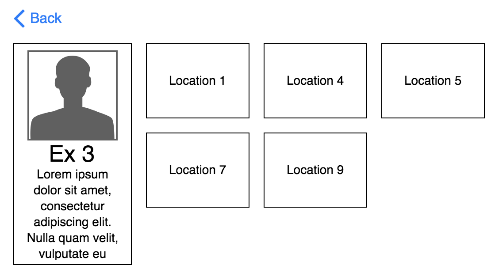

# The Ex-Tracker: Part 2

## Requirements

#### All Locations/Exs View
- As a user, I have successfully avoided my first ex and gathered a whole ton of new exs. Oops. My bad. I need to update my ex tracker to avoid all of my exs at their various locations.
- Upon arriving at the homepage, I should see a section of cards with information on my exs (it should display all of them).
```
Unflattering Image of ex
Name: xxx
Age: xxx
Flaws: xxx
```
- Upon arriving at the homepage, I should see a list of ALL locations that ALL of my exs frequent, displayed as cards.
```
Location Image
Name: [Eg: Starbucks]
Location Address: [Eg: 1 Terminal Dr #325, Nashville, TN 37214]
Time That Ex Normally Goes: [Pick one of the following options: Morning, Afternoon, Evening, After Dark]
```
- As a user, I should be displayed a search bar. This search bar should filter the results of the cards. On keypress, the text I type in the search bar should be contained in the location title text, the location address, or one of the ex's names of all cards still displayed.
- As a user, I should be displayed 4 button options for "time of day." (Options: Morning, Afternoon, Evening, After Dark). These buttons should filter the results down to each location that has a "Time That Ex Normally Goes" corresponding to the button clicked.

#### Single Ex View
- As a user, when I click on one of the ex's cards, the DOM is completely rewritten (as though I am on a new page). This new DOM should have the info for the single ex I clicked on, cards for the locations for the ex I am currently viewing, and a back button.
- If I click on the back button, I should then be viewing "All Locations/Exs View"
- This page should look like this mockup:


### Data Structure
- You should have one exs.json, this will be an array of objects representing exs. Each ex will have one key of 'locations' that has a value of an array of location ids.
- You should have one locations.json, this will be an array of objects representing locations. Each location should have an id to relate it to the ex in the step above.
- Exs can have many locations and locations can be associated with many exs.
Sample Ex:
```
{
  name: "Phil Collins",
  img: "https://www.telegraph.co.uk/content/dam/music/2017/11/23/TELEMMGLPICT000133495746_trans_NvBQzQNjv4BqYpan1rnL3YFxlcDYh3PnVXPRax-qKCsZr3UMI12uuWg.jpeg",
  age: 67,
  flaws: "Spends too much time in 'paradise', always expects me to take him home."
  locations: [1, 3, 9]
}
```

Sample Location:
```
{
  locationId: 9,
  name: "Land of Confusion"
  ...
}
```


## Technical Requirements

- You should be using Bootstrap.
- You should be using Browserify.
- You should be using jQuery for
  - DOM manipulation
    - Event listeners
    - Selecting elements from the DOM
    - Traversal
    - Filtering results
  - AJAX call to the json file of locations
- Your code should be clean and readable, with single responsibility principle.
